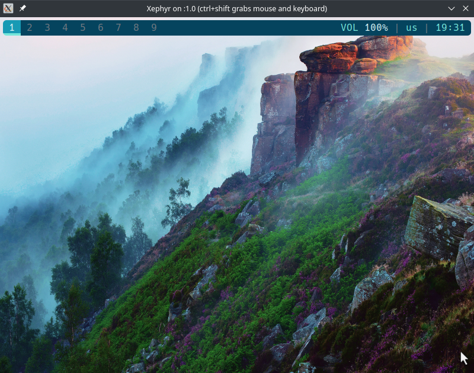

# awesomewithpolybar
<h4>My awesomewm config with polybar and gaps</h4>

Download polybar from the repos.  
Place revelations folder & rc.lua in .config/awesome  
Place polybar folder in .config/ 

change the bottom line of rc.lua to suit your need  

