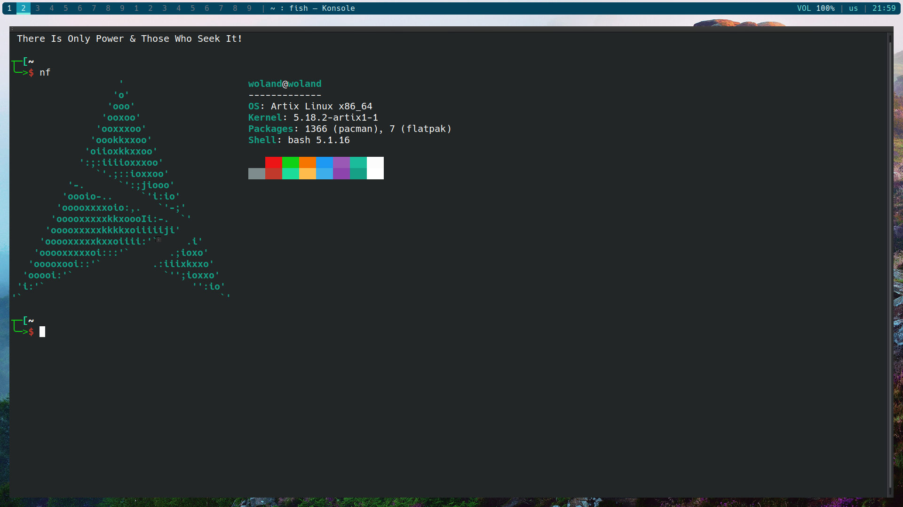
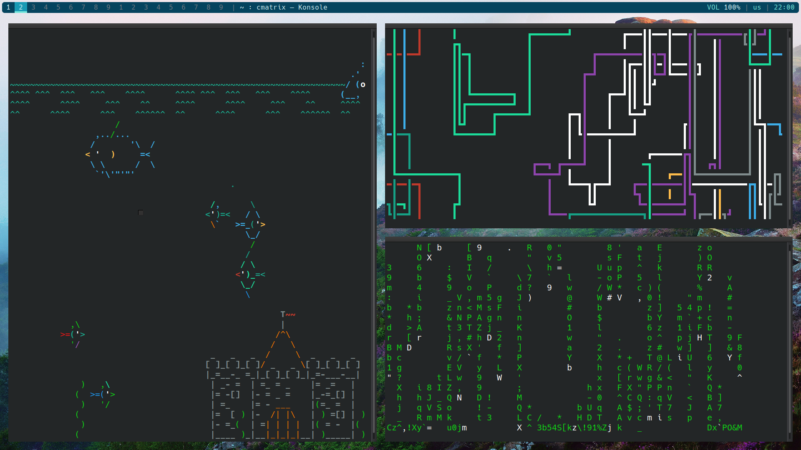

# awesomewithpolybar
<h4>My awesomewm config with polybar and gaps</h4>
  
  

Download polybar from the repos.  
Place revelations folder & rc.lua in .config/awesome  
Place polybar folder in .config/ 
I have set the default terminal to be kde konsole. Change the line about terminal to point to your termiknal of choice.
change the bottom line of rc.lua to point to the start.sh if needed  

<h2 color:red> keep in mind that without polybar you will have no bar at all! </h2>

